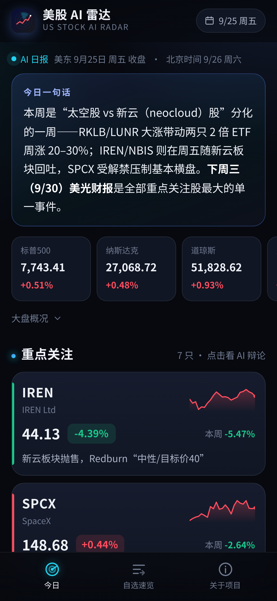
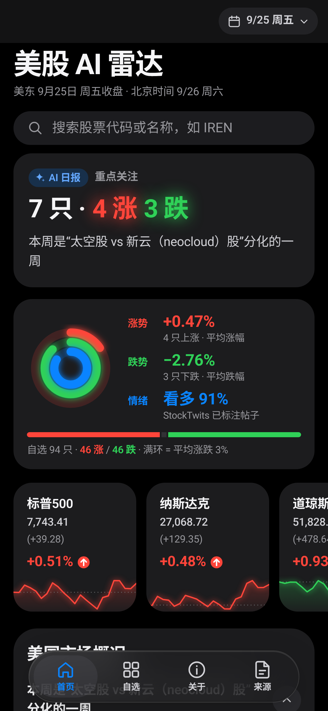
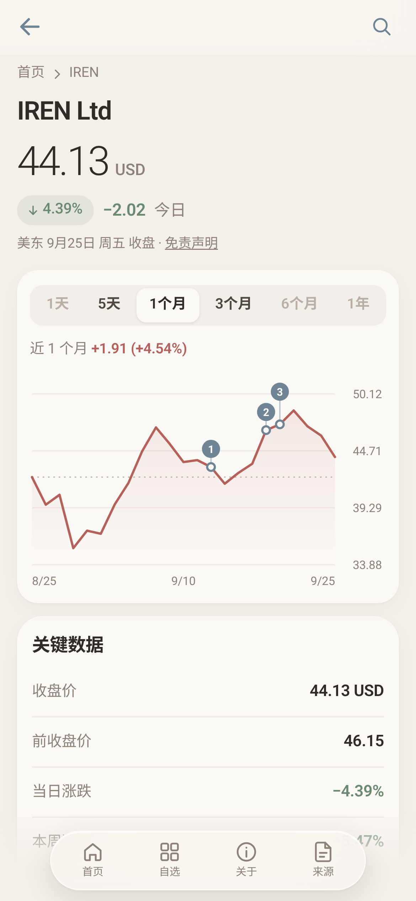
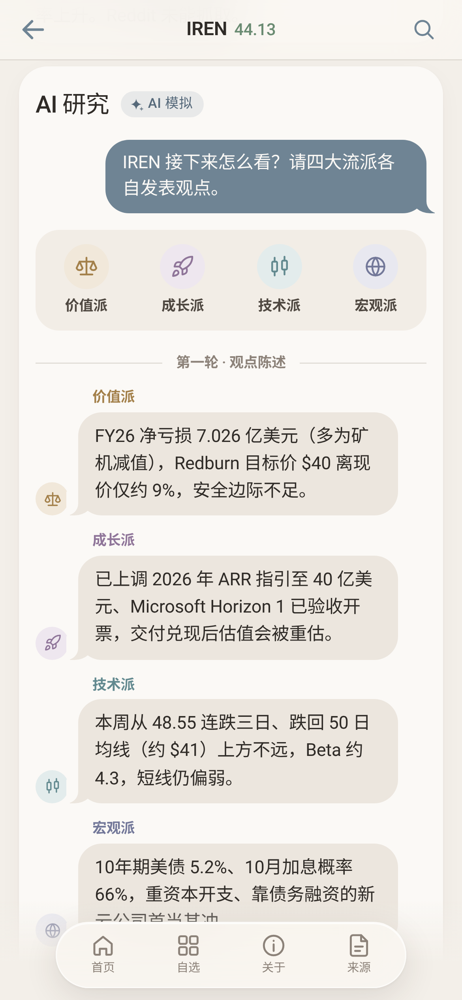
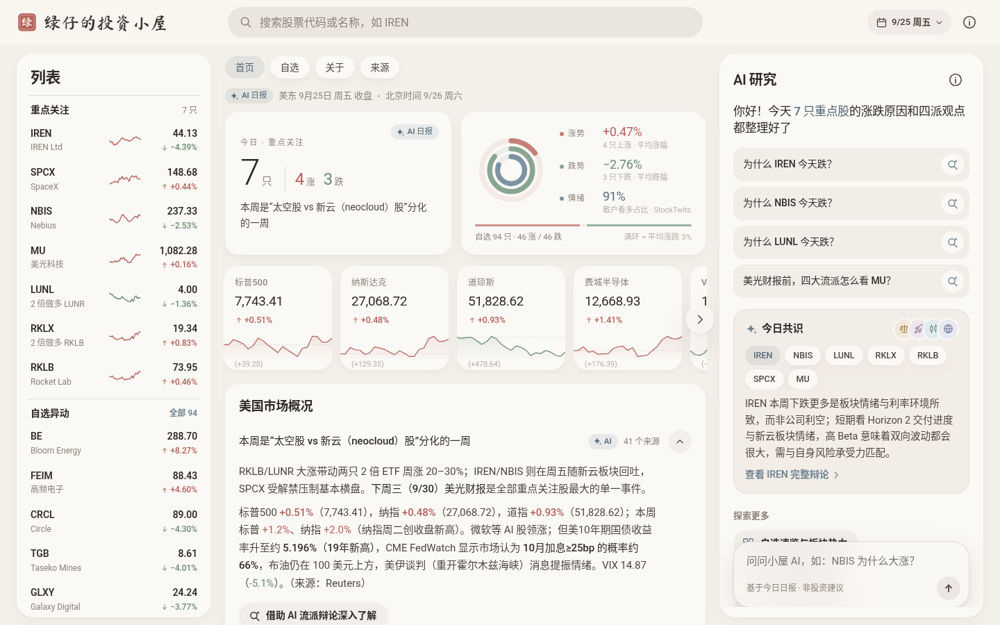

# 绿仔的投资小屋 · Lüzai's Investment Hut

_(formerly “美股 AI 雷达 · US Stock AI Radar”)_

A mobile-first PWA that explains, in Simplified Chinese, **why US stocks moved today**. An AI agent pulls together US media, filings, analyst actions and retail-forum sentiment every trading day. It then runs a **four-school AI debate** (价值派 / 成长派 / 技术派 / 宏观派) that ends in a consensus.

> AI-generated content, not investment advice. 本站内容由 AI 自动生成，不构成投资建议。

| 首页（浅色） | 首页（深色） | 个股 + 走势标注 | AI 流派辩论 |
|---|---|---|---|
|  |  |  |  |

Desktop (1440): 

## Features
- **Design**: Google-Finance-style information architecture (desktop 3 columns: list · market overview · "AI 研究" panel; index cards with sparklines; accordion market summary; 最新动态 feed; quote page with range tabs, crosshair chart and key stats) rendered in iOS-style "Liquid Glass" materials: frosted sticky nav bar, floating capsule tab bar on mobile, large titles that collapse into the nav bar, a soft Morandi palette (warm greige #f3efe9 background, off-white cards, dusty-rose up / sage down / blue-gray accent, subtle fills), editorial typography with light numerals, spring press/page motion, and automatic warm-charcoal dark mode. Signature "activity rings" card (涨势 / 跌势 / 散户情绪), iMessage-style debate bubbles, and a shareable consensus card (Web Share / copy link / save as PNG). No third-party logos or trademarks; all icons are hand-drawn inline SVG.
- **Search**: client-side ticker/name search over focus + watchlist stocks (keyboard: `/`, ↑↓, Enter). A watchlist-only ticker opens a lightweight quote page.
- **Gestures**: swipe right from the left edge on detail pages to go back.
- **首页 (home)**: date, one-line market takeaway, index chips, and 7 "重点关注" cards (price, day %, week %, 1-month sparkline, one-line reason).
- **个股详情 (stock detail)**: price and moves, a real daily-close chart (5天 / 1个月 / 3个月 tabs; 1天 intraday is not collected) with numbered markers for key news dates (tap to scrub), reasons, analyst views, a sentiment bar, and an animated **chat-style debate** (opening round → rebuttal round with @mentions → highlighted consensus card, plus a replay button).
- **自选速览 (watchlist)**: today's big movers with reasons, weekly movers, a sector heat map, and the full list sorted by absolute move.
- **关于 (about)**: problem, solution, pipeline, and design choices, written for recruiters.
- Colors follow the Chinese convention: **red = up, green = down**.
- **PWA**: manifest, icons, and a service worker (app shell cache-first, data network-first, works offline). "添加到主屏幕" works on iOS and Android.
- **China-friendly**: no Google Fonts CDN, no CDNs, no third-party JS, zero dependencies. Body text uses system fonts; only the wordmark uses self-hosted font subsets (see below).
- **Wordmark**: final logo is **B** (rounded ZCOOL KuaiLe + cottage-and-leaf mark; PWA icons in `icons/` generated by `tools/make_icons.py`, preview `screenshots/icon-preview.png`). The other drafts can still be previewed per page load with `?logo=a|c`:
  - **A** brush calligraphy + brick-red seal 「绿」 (Ma Shan Zheng)
  - **B** rounded and cute + house-with-leaf mark (ZCOOL KuaiLe)
  - **C** editorial Song-style serif + thin rules + ring monogram (ZCOOL XiaoWei)

  Fonts come from [google/fonts](https://github.com/google/fonts) `ofl/`, are licensed under **SIL Open Font License 1.1** (see `assets/fonts/OFL-*.txt`), and are subset with `pyftsubset` to just these 7 characters as woff2 (1–4 KB each). Previews: `screenshots/wordmark-{a,b,c}.png`, `screenshots/draft-{a,b,c}-mobile-home.png`.
- **Privacy**: only tickers, prices, moves and analysis are shown. No position size, cost or P&L. The converter normalizes wording to "重点关注", applies optional private scrub rules from a git-ignored `tools/scrub_local.json`, and aborts if cost/P&L-like fields show up.

- **持仓全景图 (`/panorama/`)**: Treemap of the 7 focus holdings (area = position weight, placeholder equal weights until replaced), market trend card, sector ETF diverging bars, market-session indicator; quotes refreshed by a GitHub Actions cron (see `panorama/README.md`).

## Structure
```
index.html  manifest.webmanifest  sw.js  .nojekyll
assets/app.css  assets/app.js        # hand-written SPA, hand-drawn SVG charts
icons/                               # generated by tools/make_icons.py
data/index.json                      # list of reports (newest first) + "latest"
data/reports/YYYY-MM-DD.json         # one self-contained daily report (text + chart series)
data/prices/YYYY-MM-DD.json          # raw Yahoo closes (build input, git-ignored)
tools/fetch_prices.py                # Yahoo chart API → data/prices/<date>.json (real prices only)
tools/md2json.py                     # report Markdown + prices → data/reports/<date>.json, updates index.json
tools/daily_update.sh                # fetch + convert (+ --push)
panorama/  data/panorama-weights.json  data/quotes.json  tools/fetch_quotes.py  .github/workflows/panorama-quotes.yml   # 持仓全景图, see panorama/README.md
tools/screenshots.py                 # local server + headless Chrome screenshots (390×844 light/dark, 1440×900)
```

## Daily update (how the automation plugs in)
The daily agent already writes `report-YYYY-MM-DD.md` in the same format as `report-2026-09-25.md`, with these sections: 大盘概况 / focus-stock table + per-stock `### N. TICKER（名称）｜…` blocks with 主要原因 / 机构观点 / 市场情绪 / 流派辩论 (价值派/成长派/技术派/宏观派/反驳/**共识结论**) / 自选股速览 / 下周关注 / 信息来源. After it writes the report, run:

```bash
tools/daily_update.sh 2026-09-26 ../usstock/report-2026-09-26.md --push
```
That script:
1. `fetch_prices.py` pulls ~3 months of daily closes for the focus stocks, indices and watchlist from `query1.finance.yahoo.com/v8/finance/chart` (free, no key) and cuts them at the report date.
2. `md2json.py` parses the Markdown and computes day/week moves from real closes. It extracts news dates such as `9/21` into chart markers (future dates become "即将" items), splits the debate into opening/rebuttal/consensus, and writes `data/reports/<date>.json`. It also prepends the date to `data/index.json`.
3. With `--push`, it commits and pushes. GitHub Pages redeploys automatically. Because the service worker serves data network-first, phones get the new report on the next open.

Nothing else changes. The front end always loads `index.json → latest`, and older days stay available in the date picker.
The report can also be produced directly as JSON in the same schema (see `data/reports/2026-09-25.json`) and skip the Markdown step.

## Local development
```bash
python3 -m http.server 8000     # open http://localhost:8000
python3 -m venv .venv && .venv/bin/pip install pillow playwright
.venv/bin/python tools/make_icons.py
.venv/bin/python tools/screenshots.py --full   # uses /usr/bin/google-chrome
```
Append `?noanim=1` to disable animations (used for screenshots).

## Tech
Vanilla JS/CSS, no build step and no dependencies. Charts are hand-drawn SVG. Hosted as static files (GitHub Pages).

Author: Rein
